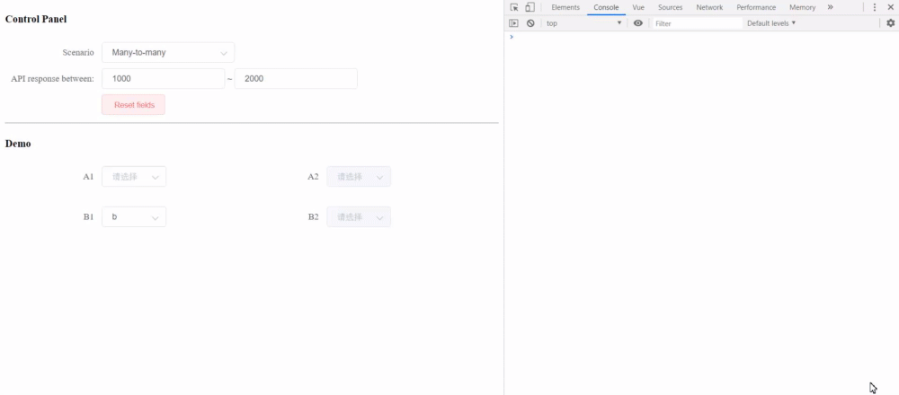

# vue-chronos

> Lightweight promise-based loading controller for Vue.js

[](https://www.npmjs.org/package/vue-chronos)
[](https://travis-ci.org/iendeavor/vue-chronos)

## Demo



## Usage

```sh
npm install vue-chronos
```

```js
import Vue from 'vue'
import Chronos from 'vue-chronos'

Vue.use(Chronos, {
  getterName: '$chronos',
  optionName: 'chronos',
})

export default {
  data () {
    return {
      form: {
        selectA1: 'a',
        selectA2: null,
        selectB1: null,
        selectB2: null,
      },
      optionsA1: ['a', 'b'],
      optionsA2: [],
      optionsB1: ['a', 'b'],
      optionsB2: [],
    }
  },

  watch: {
    async 'form.selectA1' () {
      const promise = new Promise(resolve => {
        setTimeout(() => {
          this.optionsA2 = ['c', 'd']
          this.optionsB2 = ['c', 'd']
          resolve()
        }, 1000)
      })

      await this.$chronos.$load('form.selectA1', promise)
    },
  },

  chronos () {
    return [
      ['form.selectA1', 'form.selectA2'],
      ['form.selectB1', 'form.selectA2'],
      ['form.selectA1', 'form.selectB2'],
      ['form.selectB1', 'form.selectB2'],
    ]
  },
}
```

## API

### Variables
1. `$sending`
2. `$receiving`
3. `$pending`

### Methods
1. `$load (path, promise)`
